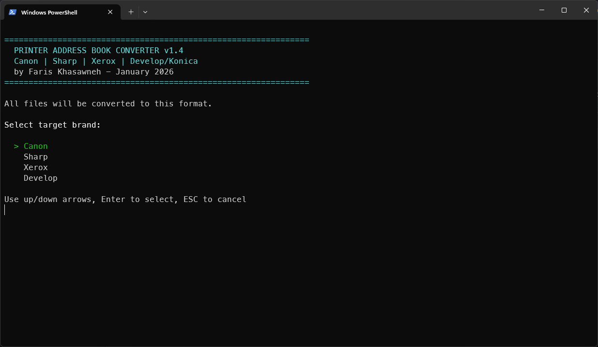

# 🖨️ Printer Address Book Converter

PowerShell tool to convert printer address book exports between Canon, Sharp, Xerox, and Develop/Konica Minolta formats.

## ✨ Features

- **🔍 Auto-detection** of source format (Canon, Sharp, Xerox, Develop/Konica/Bizhub)
- **📦 Batch conversion** of multiple files
- **🔗 Merge** multiple address books into one unified list
- **🧹 Automatic deduplication** and email validation
- **⚙️ Format-specific handling**:
  - Canon: Comment headers with DB version tag
  - Sharp: Encrypted authentication placeholders
  - Xerox: Full scan protocol fields
  - Develop/Konica: 45-column structure with FTP/SMB/WebDAV/Fax support

## 🖨️ Supported Printers

- **Canon:** iR-ADV series
- **Sharp:** MX/BP series
- **Xerox:** AltaLink, VersaLink series
- **Develop/Konica Minolta:** ineo+, bizhub series

## 📥 Installation

1. Download `Convert-PrinterAddressBook.ps1`
2. **⚡ First-time setup** (allow script execution):
   ```powershell
   # Run PowerShell as Administrator
   Set-ExecutionPolicy -ExecutionPolicy RemoteSigned -Scope CurrentUser
   ```
3. Close admin terminal, run script normally

## 🚀 Usage

Right-click `Convert-PrinterAddressBook.ps1` → **Run with PowerShell**

### 📸 Quick Demo

<table>
  <tr>
    <td></td>
    <td></td>
    <td></td>
  </tr>
  <tr>
    <td align="center"><b>1️⃣ Select conversion mode</b></td>
    <td align="center"><b>2️⃣ Choose target format</b></td>
    <td align="center"><b>3️⃣ View conversion results</b></td>
  </tr>
</table>

### 🎯 Conversion Modes

1. **📄 Single File:** Convert one address book
2. **📚 Batch Convert:** Process multiple files at once
3. **🔗 Merge:** Combine multiple address books into one unified list

The script will:
- 🔍 Auto-detect source format
- 🎨 Prompt for target format (Canon/Sharp/Xerox/Develop)
- 💾 Save output to `converted/` folder
- 🔒 Create backup in `backup/` folder
- 📊 Generate conversion log

### 💡 Example Workflow

```
Input:  Xerox-AltaLink.csv (26 contacts)
        SHARP_MX-3051.csv (13 contacts)
        
Action: Merge mode → Target: Canon

Output: Merged_to_Canon_2026-01-07.csv (39 unique contacts)
        ✓ Duplicates removed
        ✓ Invalid emails skipped
        ✓ Backup files created
```

## 📋 Output Structure

All outputs match original printer export formats exactly:

| Format  | Columns | Key Fields |
|---------|---------|------------|
| Canon   | 52      | Comment headers + objectclass, cn, mailaddress |
| Sharp   | 27      | address, name, mail-address, encrypted auth fields |
| Xerox   | 26      | XrxAddressBookId, DisplayName, E-mailAddress, Scan fields |
| Develop | 45      | AbbrNo, Name, MailAddress, FTP/SMB/WebDAV/Fax fields |

## 📁 Files Generated

- `converted/` - Converted address books
- `backup/` - Timestamped backups of source files
- `converter-YYYY-MM-DD.log` - Conversion activity log

## ⚠️ Known Limitations

- **Develop reimport detection:** Converted Develop files require manual brand selection when re-converting (original exports auto-detect correctly)
- **Email-only contacts:** Protocol fields (FTP/SMB/Fax) populated as empty when not in source

## 📋 Requirements

- Windows PowerShell 5.1+
- No external dependencies

## 👤 Author

Faris Khasawneh
January 2026

## 📄 License

MIT License - Free for personal and commercial use

---

**💼 Use Case:** Standardizing printer address books across mixed printer fleets in enterprise environments.
