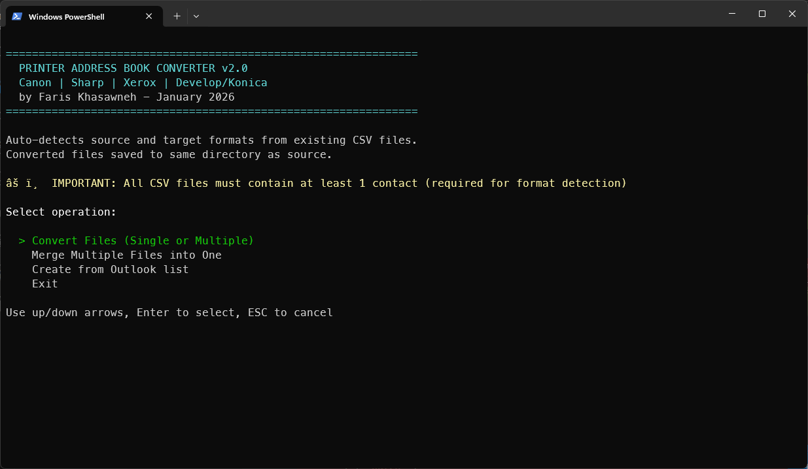
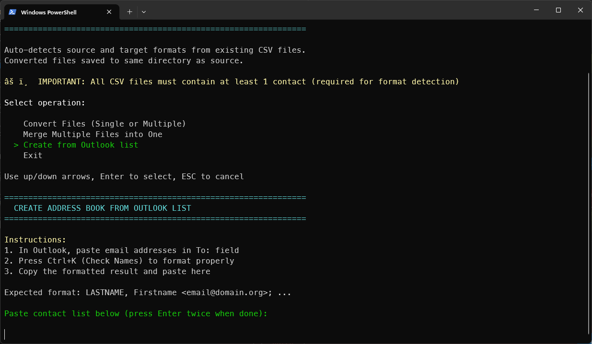
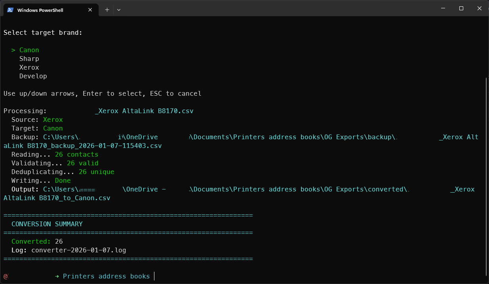

# 🖨️ Printer Address Book Converter

PowerShell tool to convert printer address book exports between Canon, Sharp, Xerox, and Develop/Konica Minolta formats.

## ✨ Features

- **🔍 Auto-detection** of source format (Canon, Sharp, Xerox, Develop/Konica/Bizhub)
- **📦 Batch conversion** of multiple files
- **🔗 Merge** multiple address books into one unified list
- **🧹 Intelligent deduplication** with fuzzy name matching
  - Detects abbreviations ("John Smith" vs "J. Smith")
  - Catches typos using edit distance algorithm
  - Configurable similarity threshold (default: 80%)
- **✅ Outlook compatibility validation**
  - Email/name length checks (Outlook limits: 254/256 chars)
  - Problematic character detection
  - Import readiness reports
- **⚙️ Format-specific handling**:
  - Canon: Comment headers with DB version tag
  - Sharp: Encrypted authentication placeholders
  - Xerox: Full scan protocol fields
  - Develop/Konica: 45-column structure with FTP/SMB/WebDAV/Fax support

## 🖨️ Supported Printers

- **Canon:** iR-ADV series, imageFORCE series
- **Sharp:** MX/BP series
- **Xerox:** AltaLink, VersaLink series
- **Develop/Konica Minolta:** ineo+, bizhub series

**📌 Note:** Export files must contain at least 1 valid contact for conversion.

## 📥 Installation

1. Download `Convert-PrinterAddressBook.ps1`
2. **⚡ First-time setup** (allow script execution):
   ```powershell
   # Run PowerShell as Administrator
   Set-ExecutionPolicy -ExecutionPolicy RemoteSigned -Scope CurrentUser
   ```
3. Close admin terminal, run script normally

## 🚀 Usage

Right-click `Convert-PrinterAddressBook.ps1` → **Run with PowerShell**

### 📸 Quick Demo

<table>
  <tr>
    <td></td>
    <td></td>
    <td></td>
  </tr>
  <tr>
    <td align="center"><b>1️⃣ Select conversion mode</b></td>
    <td align="center"><b>2️⃣ Choose target format</b></td>
    <td align="center"><b>3️⃣ View conversion results</b></td>
  </tr>
</table>

### 🎯 Conversion Modes

1. **📄 Convert Files:** Convert single or multiple address books
2. **🔗 Merge:** Combine multiple address books into one unified list
3. **📧 Create from Outlook:** Import contacts from Outlook "Check Names" format

### 🤖 Non-Interactive Mode

For automation or testing:

```powershell
# Convert Sharp export to Canon format
.\Convert-PrinterAddressBook.ps1 -SourcePath "Sharp_Export.csv" -TargetPath "Canon_Template.csv" -NoInteractive
```

**Parameters:**
- `-SourcePath`: File to convert (must contain at least 1 contact)
- `-TargetPath`: Template file for format detection only
- `-NoInteractive`: Skip all prompts
- Output saved as: `<source>_to_<target>.csv` in source directory

**The script will:**
- 🔍 Auto-detect both source and target formats
- ✅ Validate email addresses and contact data
- 💾 Save output to same directory as source file
- 📊 Generate conversion log

### 💡 Example Workflows

**Convert Multiple Files:**
```
Input:  Canon_Export.csv, Sharp_Export.csv, Xerox_Export.csv
Action: Convert mode → Select all files → Choose Develop template
Output: 3 converted files in same directory
        ✓ One prompt to open folder
        ✓ Unified success summary
```

**Merge Address Books:**
```
Input:  Xerox-AltaLink.csv (26 contacts)
        SHARP_MX-3051.csv (13 contacts)
Action: Merge mode → Target: Canon_Sample.csv (format template)
Output: Merged_converted_2026-01-29.csv (39 unique contacts)
        ✓ Duplicates removed via fuzzy matching
        ✓ Invalid emails skipped
```

**Import from Outlook:**
```
Input:  Paste Outlook contacts (Ctrl+K formatted)
Action: Create from Outlook → Choose target template
Output: Outlook_converted_2026-01-29.csv
        ✓ Automatically parsed and validated
        ✓ Prompt to open containing folder
```

## 📋 Output Structure
 Special Features |
|---------|---------|------------|------------------|
| Canon   | 52      | objectclass, cn, cnread, mailaddress | Comment headers with DB version |
| Sharp   | 27      | address, name, mail-address | Encrypted password placeholders |
| Xerox   | 26      | XrxAddressBookId, DisplayName, E-mailAddress | Scan protocol fields |
| Develop | 45      | AbbrNo, Name, SearchKey, MailAddress | Speed dial groups (Abc/Def/Ghi...)

## 📁 Files Generated

- `<filename>_converted.csv` - Converted address books (saved in same directory as source)
- `Merged_converted_YYYY-MM-DD.csv` - Merged address books
- `Outlook_converted_YYYY-MM-DD.csv` - Outlook imports
- `converter-YYYY-MM-DD.log` - Conversion activity log

**Note:** All output files are saved in the same directory as the source file (or current directory for Outlook/Merge modes). After conversion, you'll be prompted to open the folder in Explorer.

## ⚠️ Known Limitations

- **Minimum contacts:** Source files must contain at least 1 valid contact with an email address
- **Email-only contacts:** Protocol fields (FTP/SMB/Fax) populated as empty when not in source
- **Template requirement:** Target format is determined by selecting an existing CSV file as a template
- **Develop SearchKey:** Speed dial grouping based on contact's first name (Abc, Def, Ghi, Jkl, Mno, Pqrs, Tuv, Wxyz)

## 📋 Requirements

- Windows PowerShell 5.1+
- No external dependencies

## 👤 Author

Faris Khasawneh
January 2026

## 📄 License

MIT License - Free for personal and commercial use

---

**💼 Use Case:** Standardizing printer address books across mixed printer fleets in enterprise environments.
